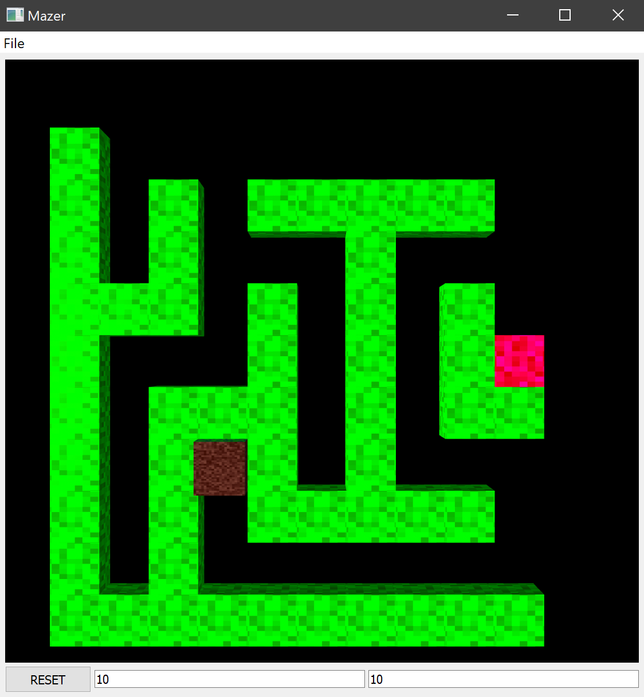

## Mazer



#### Dependencies

1. CMake >=  v3.8.0
2. QT >= 5 
3. C++ > 14

### Installation instructions

#### Windows - tested

1. Open the project in Visual Studio as a __CMake project__.
2. Click CMake > Build  in the toolbar or press (ctrl + B).
3. The executable will be generated as `mazer.exe` under the `mazer/lib` directory.

#### *Unix

1. ```
   cd mazer/
   mkdir build
   cd build
   cmake ..
   make install
   ```

2. The executable will be generated under the `mazer\lib` directory.

### Movement Controls

```
w - up
s - down
a - left
d - right
```
You can adjust the field of view using the mouse wheel. Depending upon the screen resolution you might have a zoomed in render at the beginning.
